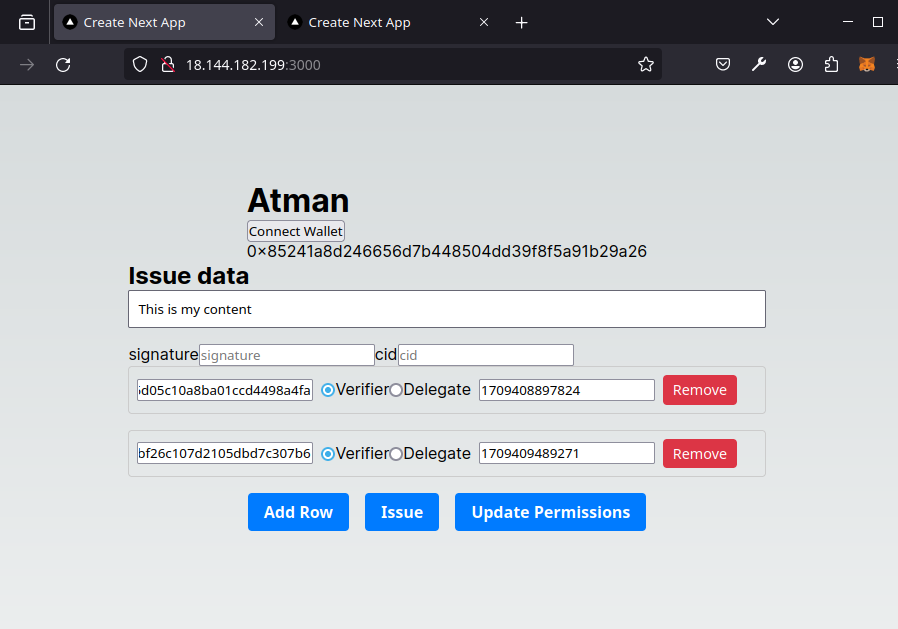
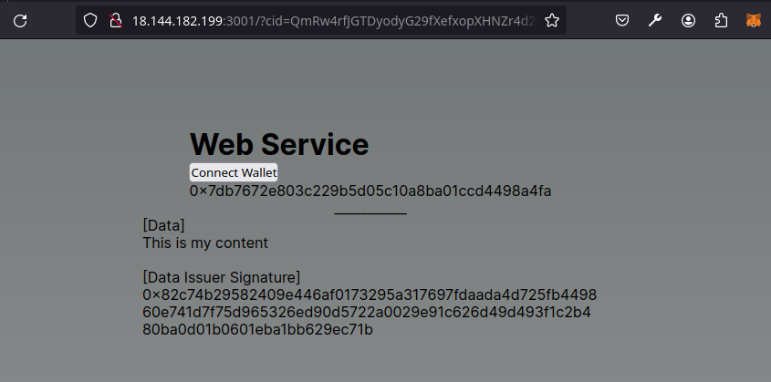

# Atman PoC

**Disclaimer**: This PoC doesn't implement the optimal full spec and architecture.

## Introductions

 The Atman Project is a decentralized protocol enhancing web trust and privacy by certifying digital content's provenance, authenticity, and lifecycle. It empowers content creators and consumers, allowing data issuers to control their data lifecycle, specify permissions, and ensure interoperability. The protocol addresses misinformation and centralized control, making compliance with regulations like GDPR intrinsic to the web's infrastructure.

### Context: The Digital Dilemma

- Web's immense influence on communication and content consumption.
- Misleading online information impacts critical decision-making.

### Problem: Eroding Trust and Centralized Control

- Reliance on big tech for centralized authenticity management.
- Generative AI has made it possible to create high-fidelity content at a low cost.
- Need for reliable verification of digital content's provenance and authenticity.

### Solution: Decentralized Empowerment, Enhanced Privacy, and Interoperability

- Technical standards for certifying content's source, history, and lifecycle.
- Enables data issuers, individuals or organizations, to control their data lifecycle.
- Allows specifying fine-grained permissions for verifiable and revocable access.
- Makes compliance with regulations like GDPR intrinsic to the web's infrastructure.
- Fosters interoperability, ensuring data accessibility across platforms and services.


## PoC Components 

- Issuer client: Web
- Web service: Web
- PKI / Data manifest store: Ethereum Sepolia Testnet
- Data channel: IPFS

## User Flow / Internal Details

### Issuer client
- Open the issuer web client and connect an Ethereum wallet.
- Produce a content with specifying permissions for muiltiple content verifiers (content consumers).
    
- By clicking the `Issue` button,
    - Sign the content using the issuer's Ethereum account private key.
    - Encrypt the content using an ephemeral AES256 symmetric key using CBC mode.
    - Encrypt the AES256 symmetric key using a [Barreto-Naehrig](https://eprint.iacr.org/2007/390.pdf) private key of the issuer, so that it can be re-encrypted by the service provider (aka. delegate) without exposing the decrypted content to the service provider.
        - In this stage, the content issuer fetches a Barreto-Naehrig public key of each content verifier whom the issuer specified in the permissions, in order to generate a proxy re-encryption key for each verifier. The Barreto-Naehrig public key of each content verifier must be registered on chain through the [web serivce](#web-service) scenario as described below.
    - Store the encrypted content and the encrypted AES256 key to IPFS, which is the data channel in our demo.
    - Store the content permissions with its [CID (Content Identifier)](https://docs.ipfs.tech/concepts/content-addressing/) to Ethereum.
        ```json
        {
            "data": {
                "provider": "IPFS"
                "cid": "QmR55ZFzBA1dYJr4QcZQ6GfHRLQmpgQYECRNVPEV6bYi7z",
            },
            "issuer": "0x85241a8d246656d7b448504dd39f8f5a91b29a26",
            "permissions": [
                {
                    "id": "0x7db7672e803c229b5d05c10a8ba01ccd4498a4fa",
                    "permission": "Delegatee",
                    "expired_at": "1709408897824"
                },
                {
                    "id": "0xbbf54b32ab703bf59bf26c107d2105dbd7c307b6",
                    "permission": "Verifier",
                    "expired_at": "1709409489271"
                }
           ]
        }
        ```
        - In this example, the issuer `0x85..` is sharing the content `QmR55..` to the verifier `0xbb..`. Also, the issuer allows the delegatee `0x7d..` can operate web services to delivery the content `QmR55..` to the verifier `0xbb..` even though the delegatee cannot decrypt the content because she cannot decrypt the AES256 symmetric key.
- After issuing the content, the issuer can update permissions by modifying the list of permissions in the UI and submitting the updated permissions to Ethereum by clicking the `Update Permissions` button.


### Web service

The web service is provided by the content delegate (service provider) allowed by each content issuer for content verifiers (content consumers) on behalf of content issuers, even though the content delegate is not able to decrypt the content.

- A content verifier opens the web service application and connect their Ethereum wallet to the web service, so that they can prove their identity to the web service provider.
- As mentioned in the [issuer client](#issuer-client) scenario, a content verifier submits its Barreto-Naehrig public key to Ethereum (which is an ephemeral key in this demo).
- Once the content issuer issues the content and permissions, the content delegate reads the permissions from Ethereum and checks if the content verifier connected to the web service has been allowed by the content issuer.
- If true, the content delegate fetched the encrypted content and the encrypted AES256 key from IPFS (which is our data channel in this demo), and re-encrypts the AES256 key encrypted by the Barreto-Naehrig public key of the content issuer using the public key of the content verifier.
    - At this stage, the content delegate cannot see the decrypted AES256 key because the [proxy re-encryption](https://en.wikipedia.org/wiki/Proxy_re-encryption) enables the secret to be re-encrypted without being decrypted.
- The encrypted content and the re-encrypted AES256 key are delivered to the verifier end, so that the AES256 key can be finally decrypted by the content verifier. As a result, the content also can be decrpyted using the decrypted AES256 key on the verifier end. The following screenshot shows the decrypted data displayed on the web service application.
    
    


## Design Rationales

### Content permissions stored on chain

- Interoperability: To support multiple service providers in decentralized environments
- Trustless environment: To minimize trust to data publisher
- Open content lifecycle verification: For anyone to verify the content is being delivered/consumed accordingly to the permissons allowed by the content issuer.

### IPFS as a content channel

IPFS may not be the optimal choice of the content channel in our protocol, but it provides the important concept "content addressing" that is powerful especially in decentralized environment.

In future designs, the more secure and sustainable content delivery channel needs to be investigated.

### Web3 wallet as a key manager

In the decentralized web, it is already a de-facto standard to use accounts managed by decentralized ledgers for decentralized web services, without introducing their own account systems. Web3 wallets provide sophisticated cryptographic signing mechanisms and the secure way to store cryptographic keys.

### Proxy re-encryption

In the environment where the content can be directly delivered between the issuer and the verifier, the traditional encryption based on the asymmetric cryptography and key exchange mechanisms.
However, there are also many cases which the issuer wants to publish the content to somewhere secure and expects the content to be delivered to the verifiers specified by the issuer.

These cases can be handled by service providers that are allowed by the content issuer as "content delegates".
The important point that the Atman Project guarantees in this model is that the content cannot be decrpyted by service providers even though the content issuer allowed them to deliver the content to the allowed verifiers on behalf of the issuer. The proxy re-encryption makes this possible.
